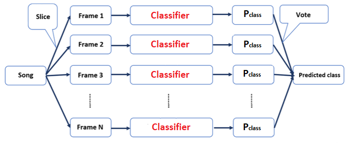
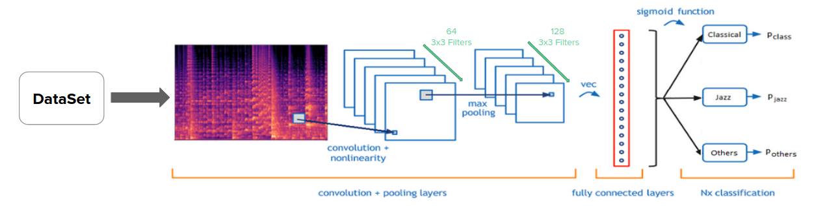
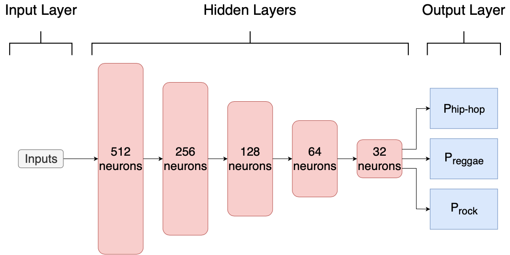
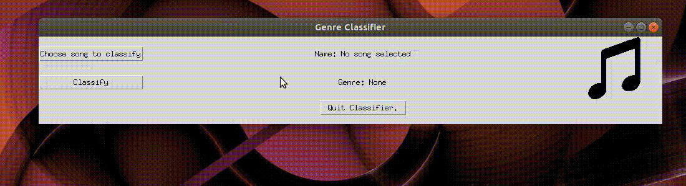

# Music Genre Recognition using Deep Learning

### Overview
Academic project oriented by Prof. Pascal Vallet at Bordeaux INP - ENSEIRB MATMECA [Bordeaux Graduate School of Engineering]:  
Inspired by the following papers and website:
```
@article{Tzatenakis,
  title={Musical genre classification of audio signals},
  author={Tzanetakis, George and Cook, Perry},
  journal={IEEE Transactions on speech and audio processing},
  year={2002}
}
```
```
@article{CNN,
  title={Automatic tagging using Deep Convolutional Neural Network},
  author={Keunwoo Choi and Gyorgy Fazekas and  Mark Sandler},
  journal={Queen Mary University of London},
  year={2016},
  publisher={ISMIR Conference}
}
```
```
@misc{FFNN,
 author   = "Pandey, Parul",
 title     = "Music Genre Classification with Python - Towards Data Science",
 url       = "https://towardsdatascience.com/music-genre-classification-with-python-c714d032f0d8"
}
```

The classifier works as the following:



It has 2 main parts, the first classifies the genre using a CNN and the Mel-Spectogram and the second classifies using chosen features.

##### CNN


##### FFNN




##### Interface

Example of the utilization of the interface:



### Requirements

- Linux (Not tested on Windows)

- requirements.txt


### Execution

- Download or clone the repository

#### Install the necessary dependecies

```
pip install -r requirements.txt
```

##### To train
Download the [dataset](http://opihi.cs.uvic.ca/sound/genres.tar.gz)

Unzip in the project folder as a folder called 'dataset'.
Make sure all the genres are there.
The dataset folder should contain 10 folders, each with 100 songs.

Train the CNN:
```
TO MODIFY
```

Train the FFNN (If you want, you can change the features used to train):
```
python training_nn.py
```

##### To run inference using the Interface
```
cd final_application
python frontend.py
```


### Contributors, Contact and License

Abdelkarim Elassam,  2020  
abdelkarim.elassam@enseirb-matmeca.fr  
ENSEIRB-MATMECA (Bordeaux INP), Electronic Engineering - Signal and Image Processing

Alix Yan,  2020  
alix.yan@enseirb-matmeca.fr  
ENSEIRB-MATMECA (Bordeaux INP), Electronic Engineering - Signal and Image Processing

Marwa Tarchouli,  2020  
marwa.tarchouli@enseirb-matmeca.fr  
ENSEIRB-MATMECA (Bordeaux INP), Electronic Engineering - Signal and Image Processing

Pedro Caio Castro Cortes C Coutinho,  2020  
pedro_caio.castro_cortes_c_coutinho@bordeaux-inp.fr  
ENSEIRB-MATMECA (Bordeaux INP), Electronic Engineering - Signal and Image Processing

Rodrigo Borba Pinheiro,  2020  
rodrigo.borba_pinheiro@bordeaux-inp.fr  
ENSEIRB-MATMECA (Bordeaux INP), Electronic Engineering - Signal and Image Processing  

This code is free to use, share and modify for any non-commercial purposes.  
Any commercial use is strictly prohibited without the authors' consent.
